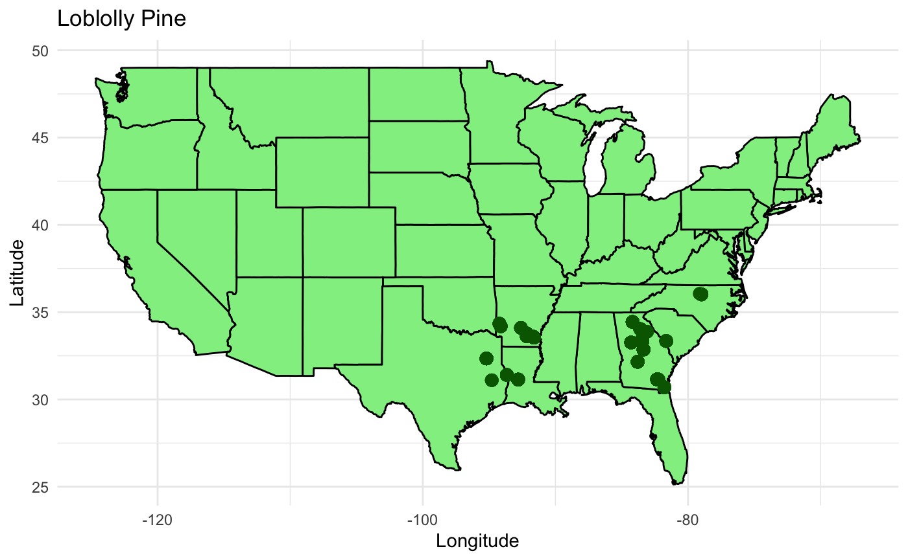
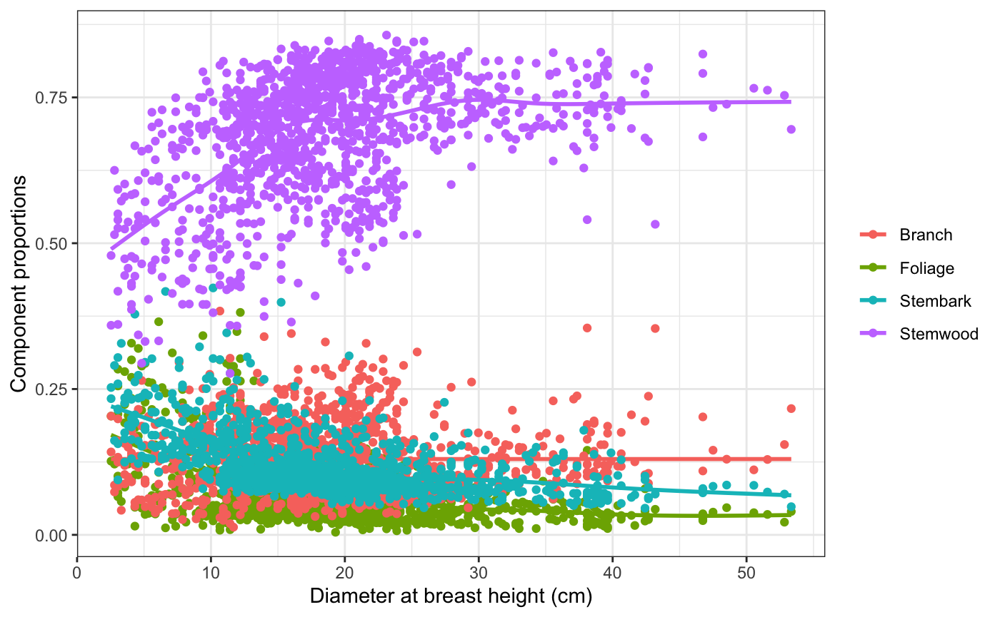
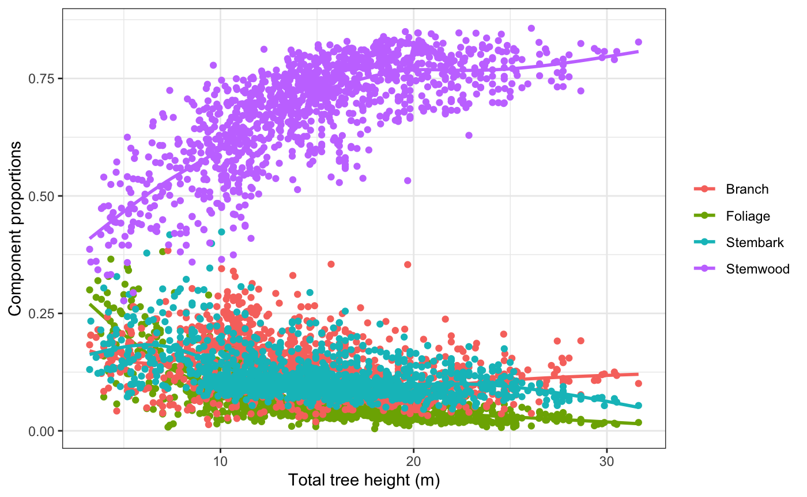
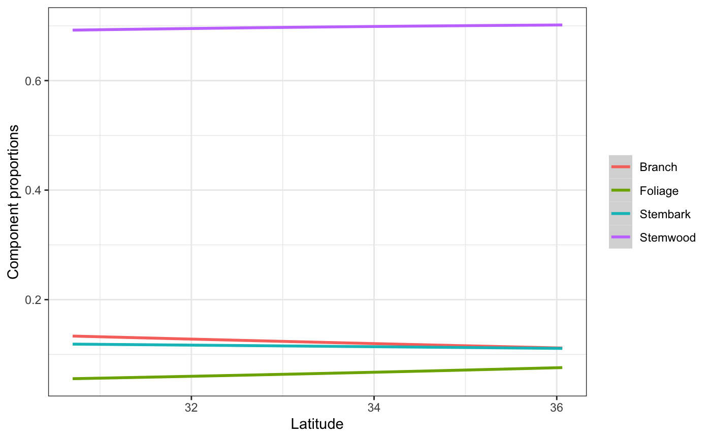

# Spatial Predictors of Biomass Distribution in Loblolly Pine (*Pinus taeda*)

**MSU Research Experience for Undergraduates (REU) -- Summer 2024**  
**Author:** Dipseka Timsina

Statistical modeling of biomass allocation across southern U.S. forests using Dirichlet regression and geographic covariates.

---

## Overview

Accurate forest biomass estimation is critical for quantifying carbon sequestration, which plays a central role in international climate agreements and sustainable energy policy. Loblolly pine (*Pinus taeda*) is one of the most ecologically and economically significant tree species in the southeastern United States, making it an ideal candidate for biomass modeling.

This project investigates how tree morphology (diameter at breast height, total height) and geographic location (latitude, longitude) jointly influence the partitioning of above-ground biomass across four components:

| Component | Variable | Description |
|-----------|----------|-------------|
| Stem wood | `stm_kg` | Primary trunk and dominant carbon store |
| Stem bark | `brk_kg` | Outer protective layer |
| Branch    | `bch_kg` | Lateral woody growth |
| Foliage   | `fol_kg` | Needles, important for nutrient cycling |

---

## Study Area

Sample sites span the native range of *Pinus taeda* across the southern United States, from Texas and Louisiana eastward through the Atlantic coastal plain.



---

## Research Questions

1. How do DBH and tree height affect biomass component proportions?
2. Do geographic covariates (latitude, longitude) significantly improve model fit?
3. What spatial gradients exist in biomass allocation across the southern U.S.?

---

## Methods

### Data Preparation

Biomass proportions for each component were calculated relative to total above-ground biomass (`agb_kg`), producing four values that sum to 1. This is a compositional data problem that requires specialized modeling.

```r
PT$fol_kg <- PT$fol_kg / PT$agb_kg
PT$brk_kg <- PT$brk_kg / PT$agb_kg
PT$bch_kg <- PT$bch_kg / PT$agb_kg
PT$stm_kg <- PT$stm_kg / PT$agb_kg
```

### Dirichlet Regression

Because proportions must sum to 1, standard regression is inappropriate. Dirichlet regression (via the `DirichletReg` package in R) handles this constraint by modeling the full composition jointly.

Two models were fit and compared:

| Model | Formula | Description |
|-------|---------|-------------|
| `diri0` | `Y ~ dbh_cm + tht_m` | Baseline, morphology only |
| `diri1` | `Y ~ dbh_cm + tht_m + lat + lon` | Full model with spatial predictors |

```r
library(DirichletReg)
library(tidyverse)

PT$Y <- DR_data(PT[, c("stm_kg", "brk_kg", "bch_kg", "fol_kg")])

diri0 <- DirichReg(Y ~ dbh_cm + tht_m, data = PT, model = "alternative")
diri1 <- DirichReg(Y ~ dbh_cm + tht_m + lat + lon, data = PT, model = "alternative")

anova(diri1, diri0)
```

### Model Evaluation

Models were compared using ANOVA (deviance) and RMSE calculated per component:

```r
library(Metrics)

rmse_stm1 <- rmse(PT$Y[, "stm_kg"], fitted(diri1)[, "stm_kg"])
rmse_brk1 <- rmse(PT$Y[, "brk_kg"], fitted(diri1)[, "brk_kg"])
rmse_bch1 <- rmse(PT$Y[, "bch_kg"], fitted(diri1)[, "bch_kg"])
rmse_fol1 <- rmse(PT$Y[, "fol_kg"], fitted(diri1)[, "fol_kg"])
```

---

## Results

### Component Proportions vs. DBH

Stem wood proportion increases sharply with DBH, while foliage declines. Branch and stem bark proportions remain relatively stable at larger diameters.



### Component Proportions vs. Tree Height

Similar patterns emerge with total tree height. Stem wood dominates at greater heights while foliage and bark proportions decrease.



### Latitude Effect

Holding DBH, height, and longitude at their means, the model predicts increasing foliage proportion at higher latitudes (30N to 36N), while branch proportion decreases slightly. Branches and stem bark converge near 36N.

```r
newdat <- PT
newdat$tht_m  <- mean(PT$tht_m)
newdat$dbh_cm <- mean(PT$dbh_cm)
newdat$lon    <- mean(PT$lon)

newdat$stm1 <- predict(diri1, newdata = newdat)[, 1]
newdat$brk1 <- predict(diri1, newdata = newdat)[, 2]
newdat$bch1 <- predict(diri1, newdata = newdat)[, 3]
newdat$fol1 <- predict(diri1, newdata = newdat)[, 4]
```



### Key Finding

ANOVA confirmed that `diri1` significantly outperforms `diri0`. Geographic variables are meaningful predictors of biomass allocation, not noise.

---

## Implications

**Carbon accounting:** Spatial predictors improve the accuracy of regional biomass estimates relevant to carbon sequestration policy.

**Sustainable forestry:** Geographic variation in biomass partitioning can inform region-specific harvest and management strategies.

**Climate science:** More accurate compositional models strengthen the empirical foundation for national and international carbon commitments.

---

## Repository Structure

```
loblolly-biomass-spatial/
├── figures/
│   ├── fig_dbh.png
│   ├── fig_height.png
│   ├── fig_latitude.png
│   └── fig_map.png
├── data/
│   └── updateddata.csv
├── analysis.Rmd
└── README.md
```

---

## Reproducing the Analysis

```r
install.packages(c("DirichletReg", "tidyverse", "Metrics", "maps"))
```

Open `analysis.Rmd` in RStudio and knit, or run sections interactively. Data columns used:

| Column | Description |
|--------|-------------|
| `spp` | Species |
| `dbh_cm` | Diameter at breast height (cm) |
| `tht_m` | Total tree height (m) |
| `stm_kg` | Stem wood biomass (kg) |
| `brk_kg` | Stem bark biomass (kg) |
| `bch_kg` | Branch biomass (kg) |
| `fol_kg` | Foliage biomass (kg) |
| `agb_kg` | Total aboveground biomass (kg) |
| `lat` / `lon` | Geographic coordinates |

---

## Author

**Dipseka Timsina**  
Undergraduate Researcher, Mississippi State University REU, Summer 2024  
d[dipsekatimsina75@gmail.com](mailto:dipsekatimsina75@gmail.com) | [LinkedIn](https://www.linkedin.com/in/dipsekatimsina/)

---

## Acknowledgments

This research was conducted as part of the MSU Research Experience for Undergraduates (REU) Program. Special thanks to my research mentors and the MSU forestry and statistics teams.

---

## License

This project is open-source under the [MIT License](LICENSE).
